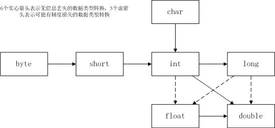

# 数据类型

1. Java中的数据类型分成：**引用类型和简单类型**两个大类；
2. 引用类型包括：**类、接口、数组和null类型**；
3. 简单类型包括：**数值类型和布尔类型**。

## 1、整数

### 1.1 取值范围

Java中整型的范围与运行Java的机器无关。它只有有符号的整数，没有无符号的。下面是它们的范围：

|数据类型|字节|范围|
|:-:|:-:|:-:|
|byte|1字节|-128 ~ 127|
|short|2字节| -32768 ~ 32767 （正负3万）|
|int|4字节|-2 147 483 648 ~ 2 147 483 647 （正负20亿）|
|long|8字节|-9 223 372 036 854 775 808 ~ 9 223 372 036 854 775 807|

其他：

|编号|总结|
|:-:|:-:|
|1|若要表示long类型需要在数字后加L或l，同样的还有float和double|
|2|二进制前加0b，八进制前加0，十六进制前加0x或0X|
|3|Java中没有unsigned类型|
|4|1_000_000即一百万，可以加下划线，使数字更易读，没有实际意义|

### 1.2 整数的取值范围与二进制表示

java中用补码表示二进制数，补码的最高位是符号位，最高位为“0”表示正数，最高位为“1”表示负数。

正数补码为其本身；负数补码为其绝对值各位取反加1. 例如：

    +21，其二进制表示形式是00010101，则其补码同样为00010101
    -21，按照概念其绝对值为00010101，各位取反为11101010，再加1为11101011，即-21的二进制表示形式为11101011

计算个整数类型的取值范围的步骤：

- Step 1：byte为一字节8位，最高位是符号位，即最大值是01111111，因正数的补码是其本身，即此正数为01111111，十进制表示形式为127
- Step 2：最大正数是01111111，那么最小负是10000000(最大的负数是11111111，即-1)
- Step 3：10000000是最小负数的补码表示形式，我们把补码计算步骤倒过来就即可。10000000减1得01111111然后取反10000000
- Step 4：因为负数的补码是其绝对值取反，即10000000为最小负数的绝对值，而10000000的十进制表示是128，所以最小负数是-128
- Step 4：由此可以得出byte的取值范围是-128到+127
- 另外，整数类型包装对象提供了`MAX_VALUE`和`MIN_VALUE`两个字段，表示指定类型的最大值和最小值，还有从字符串中获取整数的方法`valueOf(String)`等

## 2、浮点数

### 2.1 float和double

#### float

- float 数据类型是单精度、32位、符合IEEE 754标准的浮点数
- 浮点数不能用来表示精确的值，如货币
- 例子：float f1 = 234.5f，末尾要加f

#### double

- double 数据类型是双精度、64 位、符合IEEE 754标准的浮点数
- 浮点数的默认类型为double类型
- double类型同样不能表示精确的值，如货币
- 例子：double d1 = 123.4

### 2.2 浮点数的存储

也就是

    一个float类型 = 1bit（符号位）+ 8bits（指数位）+ 23bits（尾数位）
    一个double包括 = 1bit（符号位）+ 11bits（指数位）+ 52bits（尾数位）  

于是，float的指数范围为-128~+127，而double的指数范围为-1024~+1023，并且指数位是按补码的形式来划分的（和上面的byte一样）。因此，float的范围为-2^128 ~ +2^127，也即-3.40E+38 ~ +3.40E+38；double的范围为-2^1024 ~ +2^1023，也即-1.79E+308 ~ +1.79E+308。

### 2.3 精度问题

float和double的精度是由尾数的位数来决定的。浮点数在内存中是按科学计数法来存储的，其整数部分始终是一个隐含着的“1”，由于它是不变的，故不能对精度造成影响。

float：2^23 = 8388608，一共七位，由于最左为1的一位省略了，这意味着最多能表示8位数： 2*8388608 = 16777216 。有8位有效数字，但绝对能保证的为7位，也即float的精度为7\~8位有效数字；double：2^52 = 4503599627370496，一共16位，同理，double的精度为16\~17位。

在使用浮点类型的时候很容易出现意想不到的结果（[了解更多](http://blog.csdn.net/zq602316498/article/details/41148063)），所以在精度要求比较高的时候建议使用BigDecimal.

## 3、布尔类型

|编号|总结|
|:-:|:-:|
|1|boolean数据类型表示一位的信息|
|2|这种类型只作为一种标志来记录 true/false 情况|
|3|只有两个取值：true 和 false|
|4|默认值是 false|
|5|Java中0不能代表false，1也不能代表true|

## 4、字符类型

|编号|总结|
|:-:|:-:|
|1|char类型是一个单一的 16 位 Unicode 字符（双字节）|
|2|最小值是 \u0000（即为0）|
|3|最大值是 \uffff（即为65,535）|
|4|char 数据类型可以储存任何字符|

## 5、[字符串类型](Java/Strings.md)

## 6、[数组类型](Java/Array.md)

## 7、装箱

1. Java中存在8种简单类型：boolean, byte, short, int, long, float和double.
2. 对应的有8种包装类：Boolean, Byte, Character, Short, Integer, Long, Float和Double. 
3. Java无论装箱和拆箱都存在显示和隐式转换两种方式. 
4. 虽然很多场合下基本数据类型和它的包装类能达到相同的效果，但是使用包装类对基本数据类型进行包装会有额外的开销。所以，能不使用包装类时，尽量使用基本数据类型。

示例：

	public static void main(String[] args) {
		int var1=10;
		Integer obj1=var1;  			//隐式装箱
		Integer obj2=(Integer)var1;  	//显示装箱
		int var2=obj1;  				//隐式拆箱
		int var3=(int)obj2;  			//显式拆箱
	}

## 8、类型转换

1. 自动类型转换（隐式转换）：隐式转换只允许发生在从小的值范围类型到大的值范围类型的转换，转换后数值大小不受影响. 但可能会导致精度降低.
2. 强制类型转换（显式转换）

关于强制类型转换的总结：

|编号|总结|
|:-:|:-:|
|1|强制类型转换有时候会发生截断，比如300转换为byte类型会得到44|
|2|不存在到char类型的隐式转换|
|3|布尔类型不允许进行任何的类型转换|
|4|整数+浮点数时，浮点数为double则另一个是double，浮点数为float则另一个是float，整数是long则另一个是long，否则两个都是int|
|5|上面的转换图实线箭头表示无信息丢失的转换，虚线箭头表示可能有精度损失的转换。可见，从字节小的到字节大的没有损失，从字节大的到字节小的会有精度损失|
|6|将float和double转换成整数时，对该数字进行截尾，即舍弃小数部分，0.7将会被转换成0|
|7|表达式中最大的数据类型决定了表达式的结果，如果将float与double相乘，结果就是double;如果将int和long相乘，结果就是long|

## 9、值类型和引用类型

值类型和引用类型的区别的示例代码：

    public static void main(String ...args) {
        ValueHolder holderPositive = new ValueHolder(1);
        ValueHolder holderNegative = new ValueHolder(-1);
		
        swap(holderNegative, holderPositive); // 交换引用，无法达到交换效果
        System.out.println("holderPositive.value=" + holderPositive.value + ", " + "holderNegative.value=" + holderNegative.value);
        
		swapValue(holderNegative, holderPositive); // 交换引用的字段，可以达到交换效果
        System.out.println("holderPositive.value=" + holderPositive.value + ", " + "holderNegative.value=" + holderNegative.value);
        
		int positive = 1, negative = -1;
        swap(positive, negative); // 交换值类型的值，无法达到交换效果
        System.out.println("positive=" + positive + ", " + "negative=" + negative);
        
		Integer objPos = 1, objNeg = -1;
        swap(objPos, objNeg); // 使用整数类型的包装类型来交换，无法达到交换效果
        System.out.println("objPos=" + objPos + ", " + "objNeg=" + objNeg);

        System.out.println("------------------------");
        positive = negative;
        positive = 2; // 修改一个值类型不会影响另一个
        System.out.println("positive=" + positive + ", " + "negative=" + negative);
		
        holderPositive = holderNegative;
        holderPositive.value = 2; // 修改一个引用会影响到另一个
        System.out.println("holderPositive.value=" + holderPositive.value + ", " + "holderNegative.value=" + holderNegative.value);
    }

    /**
     * 交换两个引用类型的字段：对各个引用的字段进行了修改（相当于修改了内存块上的记录） */
    private static void swapValue(ValueHolder holder1, ValueHolder holder2) {
        int value = holder1.value;
        holder1.value = holder2.value;
        holder2.value = value;
    }

    /**
     * 交换两个引用类型的引用：仅仅交换了传入的应用的副本（副本指向了其他地方） */
    private static void swap(ValueHolder holder1, ValueHolder holder2) {
        ValueHolder value = new ValueHolder(holder1.value);
        holder1 = holder2;
        holder2 = value;
    }

    /**
     * 使用整数类型的包装类型来进行交换：这里相当于重新装箱，不会修改原始对象的字段（副本指向了其他地方） */
    private static void swap(Integer integer1, Integer integer2) {
        int value = integer1.intValue();
        integer1 = integer2.intValue();
        integer2 = value;
    }

    /**
     * 交换两个值类型：交换的只是副本的值，原来的值不会变化 */
    private static void swap(int positive, int negative) {
        int value = positive;
        positive = negative;
        negative = value;
    }

    public class ValueHolder {
        public int value;

        public ValueHolder(int value) {
            this.value = value;
        }
    }

输出结果：

	holderPositive.value=1, holderNegative.value=-1
	holderPositive.value=-1, holderNegative.value=1
	positive=1, negative=-1
	objPos=1, objNeg=-1
	------------------------
	positive=2, negative=-1
	holderPositive.value=2, holderNegative.value=2

**结论**：

|编号|结论|
|:-:|:-:|
|1|在Java中对基本数据类型，Java传递值的副本；对一切引用类型，Java都传递引用的副本|
|2|对于引用类型，两个变量可能引用同一对象，因此对一个变量的操作可能影响另一个变量所引用的对象|
