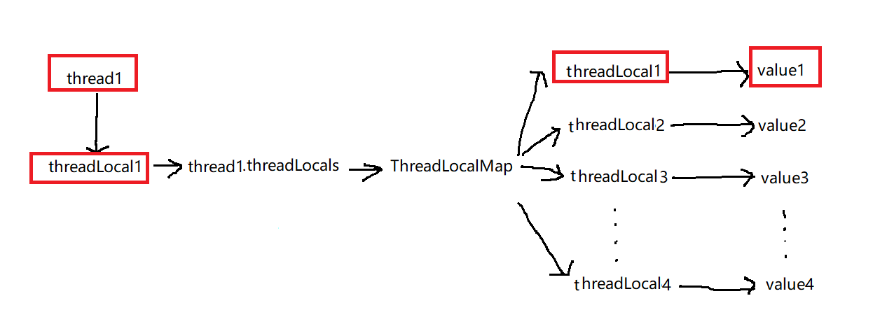

# ThreadLocal的使用及其源码实现

## 1、ThreadLocal的使用

防止任务在共享资源上产生冲突的一种方式是根除对变量的共享，使用线程的本地存储为使用相同变量的不同线程创建不同的存储。

下面是一个ThreadLocal的实例。这里我们使用了静态的全局变量`ThreadLocal`对象来保存`Integer`类型的值。
我们在不同的线程中将指定的数字传入到`threadLocal`中进行保存。然后，再将其读取出来：

    private static ThreadLocal<Integer> threadLocal = new ThreadLocal<Integer>();

    public static void main(String...args) {
        threadLocal.set(-1);
        ExecutorService executor = Executors.newCachedThreadPool();
        for (int i=0; i<5; i++) {
            final int ii = i; // i不能是final的，创建临时变量
            executor.submit(new Runnable() {
                public void run() {
                    threadLocal.set(ii);
                    System.out.println(threadLocal.get());
                }
            });
        }
        executor.shutdown();
        System.out.println(threadLocal.get());
    }

从程序的执行结果可以看出，每个线程都正确地读取出来了保存到ThreadLocal中的数据。

所以，我们总结一下`ThreadLocal`的作用就是，存储在`ThreadLocal`中的变量是线程安全的，每个线程只能读取出自己存储的值。

通常它的使用方式就是定义一个静态全局的`ThreadLocal`实例，然后每个线程使用它来读写只有自己会用到的数据。
比如，我们要为每个线程创建了一个数据库连接，并且该连接只允许该线程自己使用，那么可以将它存储在`ThreadLocal`中，
然后在用到的地方获取。

看了上面的例子，也许你会又以下一些问题：

1. ThreadLocal中存储的值是如何保证绝对的线程安全的？
2. 那么这些值是存储在什么地方？
3. 是静态类型的还是实例类型的？
4. 如果某个线程执行完毕了，被销毁了，那么这些存储的值会被怎么处理呢？
5. ……

带着上面的这些问题，我们来看下在JDK源码中`ThreadLocal`是如何实现的。

## 2、ThreadLocal的作用原理

在上面的程序中，我们将`ThreadLocal`定义为全局的静态变量。
每次只要在指定的线程中调用`ThreadLocal`的`set()`和`get()`就可以读写保存到指定的线程名下的数据。
其实，读写数据的时候，`ThreadLocal`每次会调用`Thread.currentThread()`方法获取当前的线程的实例，
然后使用它作为键从哈希表中获取值。

我们还是先从读取的操作来看。

以下是`ThreadLocal`中`set()`方法的代码：

    public T get() {
        Thread t = Thread.currentThread();  // 1
        ThreadLocalMap map = getMap(t);  // 2
        if (map != null) {  // 3
            ThreadLocalMap.Entry e = map.getEntry(this);  // 4
            if (e != null) {
                T result = (T) e.value; // 5
                return result;
            }
        }
        return setInitialValue();
    }

这里首先会再步骤1中获取到当前线程的实例，然后再步骤2中通过`getMap()`方法，使用当前的线程的`ThreadLocalMap`。
这里的`ThreadLocalMap`的定义如下：

    static class ThreadLocalMap {

        static class Entry extends WeakReference<ThreadLocal<?>> {
            Object value;
            Entry(ThreadLocal<?> k, Object v) {
                super(k);
                value = v;
            }
        }
		
        private Entry[] table;
		
        private Entry getEntry(ThreadLocal<?> key) {
            int i = key.threadLocalHashCode & (table.length - 1);
            Entry e = table[i];
            if (e != null && e.get() == key)
                return e;
            else
                return getEntryAfterMiss(key, i, e);
        }
		
        // ...
    }

然后，我们看下`getMap()`方法的定义：

    ThreadLocalMap getMap(Thread t) {
        return t.threadLocals;
    }

也就是说实际上当我们调用`get()`方法的时候，会先获取当前线程中的`threadLocals`字段，该字段是`ThreadLocalMap`类型的。
然后，我们使用当前的ThreadLocal实例作为键来从哈希表中获取到一个`Entry`，而实际的值就保存再`Entry`的`value`字段中。

就像上面的`getEntry()`方法定义的那样，似乎这里的哈希表只是一个数组，那哈希冲突是怎么解决的呢？
实际上，我们知道通常解决哈希冲突有两种解决方式，一种是拉链法，一种是线性探测法。
前者在`HashMap`和`ConcurrentHashMap`中使用较多，而这里用到的其实就是线性探测法。
说白了就是将所有的值放在一个数组里面然后根据散列的结果到数组中取值，具体的实现方式可以看相关的数据结构知识点。

等下，这里的关系是不是有点乱。我们来捋一下：

我们使用`ThreadLocal`存储的值实际是存储在`Thread`使用`ThreadLocalMap`当中的，
而这里的`ThreadLocal`实例值起到了一个哈希表的键的作用。

至此，我们已经了解了ThreadLocal的实现的原理，本来想看下`set()`方法的，但是到此已经基本真相大白了，所以也就没有继续下去的必要了。

我们回过头来看下之前提出的几个问题：

1. ThreadLocal中存储的值是如何保证绝对的线程安全的？
实际上每个值都是存在线程内部的，ThreadLocal只用来帮助我们从该线程内部的哈希表中找到存放的那个值。
2. 那么这些值是存储在什么地方？线程内部的实例字段。
3. 是静态类型的还是实例类型的？线程内部的实例字段。
4. 如果某个线程执行完毕了，被销毁了，那么这些存储的值会被怎么处理呢？因为是线程的局部字段，所以线程不在了，值就没有了。

以上就是ThreadLocal的用法和实现原理。
