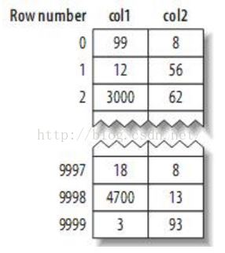
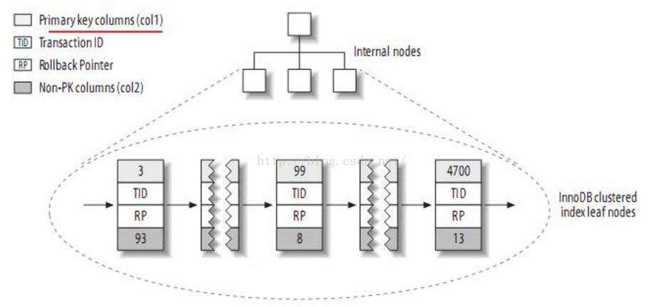
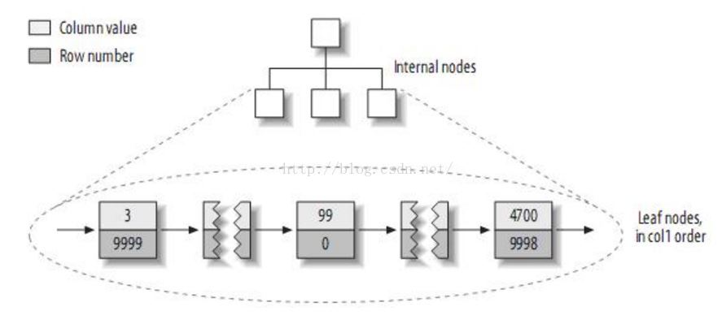

# 高性能MySQL

## 1、MySQL结构

每个客户端连接会在服务器进程中拥有一个线程，该连接的查询只会在单独的线程中执行。MySQL会解析查询，并创建内部数据结构，然后对其进行各种优化。对于SELECT语句，解析查询之前，服务器会先检查缓存，如果能够在其中找到对应的查询，服务器就不再执行查询解析，而是直接返回缓存中的结果。

### 并发控制

MySQL在两个层面实现并发控制：服务器层与存储引擎层。

在处理并发读或写时，可以通过实现一个由两种锁组成的系统来解决问题。这两种锁通常被称为**共享锁和排他锁**，或者称为**读锁和写锁**。读锁是共享的，或者说是相互不阻塞的，多个客户可以在同时读取同一数据。而写锁是排他的，同一时刻只能有一个用户能够写入，并防止其他用户读取正在写入的数据。

**锁粒度**是指加锁的对象的大小。显然，锁的粒度越小，并发控制效率越高。锁的各种操作，包括获得锁、检查锁和释放锁等，都会增加系统开销。因此，如果系统花费大量时间来管理锁，而不是用来获取数据，就会影响系统性能。

有两种常见的缩策略，**表锁和行级锁**。表锁开销较小，但是并发控制不好。行级锁可以很好地实现并发控制，但是开销比较大。

### 事务

事务将几个操作作为一个整体，要么全部执行，要么全部放弃。事务的四大特性**ACID**：

|编号|特性|说明|
|:-:|:-:|:-:|
|1|原子性|整个事务要么提交要么回滚，必须作为一个整体（整个事务作为一个整体）|
|2|一致性|数据库总是从一个一致状态转换到另一个一致状态（不增就不减）|
|3|隔离性|事务提交之前所做的修改不可见|
|4|持久性|事务提交之后，将修改持久化到数据库中|

事务处理也会使系统做更多额外工作，用户可以根据是否需要进行事务处理，选择合适的存储引擎。

下面是四种事务的隔离级别：

|编号|隔离级别|说明|
|:-:|:-:|:-:|
|1|READ UNCOMMITTED (未提交读)|没有提交、但已经被修改的数据可以被读到，也叫**脏读**|
|2|READ COMITTED (提交读)|一个事务开始时，只能看见已经提交的修改，并且所做的修改对其他事务不可见。这种存在的一个问题叫**不可重复读**，就是指事务A读取某条记录之后，事务B对其进行了修改，这时当A再次读取该数据的时候就会发现与之前读取的结果不一样|
|3|REPEATABLE READ (可重复读)|事务A对数据库所有行做了修改时，事务B对向数据库中插入了一行新的数据。这时A发现还有没有修改的记录，就行发生幻觉一样，叫做**幻读**。MySQL默认级别|
|4|SERIALIZABLE (可串行化)|事务按照串行的方式执行，并在每行数据上加锁，可能产生大量的超时和锁争用问题|

死锁指的是多个事务在同一资源上相互占用，并请求对方占用的资源，导致恶性循环的现象。数据库系统中实现了各种死锁检测和死锁超时机制。

MySQL支持两种事务型存储引擎：InnoDB和NDB Cluster，此外还有一些第三方的引擎. 在MySQL中默认是自动提交事务的，每个查询操作被当作一个事务。可以使用`set autocommit 0/1`来设置是否自动提交。可以通过`set session transaction isolation level READ COMMITED`来设置隔离级别。在同一事务中使用多种存储引擎是不可靠的。

### 多版本并发控制MVCC

MySQL中大多事务型存储引擎实现的都不是简单的行级锁，一般同时实现了多版本并发控制。MVCC的实现是通过保存数据在某个时间点的快照来实现的。即，不论需要执行多长时间，每个事务看到的数据都是一致的。典型的实现有**乐观并发控制和悲观并发控制**。

InnoDB的MVCC通过在每行记录的后面保存两个隐藏的列来实现。这两个列，一个用来保存过期(被删除)的版本号，一个用来保存创建的版本号。每个事务开始时，会使版本号递增。事务开始时的版本号被用作事务的版本号：

|操作的实现逻辑|
|:-:|
|在查询的时候，会检查版本号，并返回小于等于当前版本号，并且删除版本号大于当前事务版本号的记录|
|删除时将当前版本号作为删除版本号|
|插入时将当前系统版本号作为行版本号|
|更新时，插入一行新纪录，并保存当前系统版本号作为行版本号，同时保持当前系统版本号作为之前记录的删除版本号|

### MySQL存储引擎

`.frm`文件用来保存表的定义，可以使用`SHOW TABLE STATUS`命令显示表的相关信息。

#### InnoDB存储引擎

MySQL默认事务型存储引擎，拥有良好的性能和自动崩溃恢复特性。

|编号|总结|
|:-:|:-:|
|1|用MVVC支持高并发，实现四个标准的隔离级别，默认为REPEATABLE READ，并且通过间隙锁(next-key locking)策略使得InnoDB锁定查询涉及的行，还会对索引中的间隙进行锁定，防止幻读出现|
|2|基于聚簇索引建立，对主键查询有很高的性能。但是二级索引(secondary index，非主键索引)必须包含主键列，如主键索引过大，其它的所有索引都会很大|
|3|通过一些机制和工具支持真正的热备份|

#### MyISAM存储引擎

MySQL5.1及之前版本的默认存储引擎。支持全文索引、压缩、空间函数(GIS)，不支持事务和行级锁，并且崩溃后无法安全恢复。对于只读数据，或者表比较小，可以忍受修复(repair)操作，可以考虑MyISAM。它将表存储在两个文件中：数据文件和索引文件，分别以`.MYD`和`.MYI`为拓展名。

|编号|总结|
|:-:|:-:|
|1|MyISAM不支持事务和行级锁，而且无法在崩溃之后安全恢复。|
|2|它对整张表加锁，而不是某行，最典型的性能问题为表锁。|
|3|如果创建并导入数据之后，不会再进行修改，可以使用压缩表来减少空间占用和IO，从而提升查询性能|
|4|支持全文索引，这是基于分词创建的索引。即使是BOLB和TEXT等长字段，也可以基于前500个字符创建索引。|

还有一些其他的存储引擎。

除非某些InnoDB不具备的特性，并且没有其他方法可以替代，否则都应该优先优先选择InnoDB引擎。除非万不得已，否则不要混合使用多种存储引擎，否则可能带来一些复杂的问题及潜在的BUG. 

#### 修改存储引擎

1. `Alter table tbl_name engine = Innodb`：需要执行很长时间，MySQL会按行将数据从原表复制到一张新的表中，在复制期间可能会小号系统的IO能力，同时在原表上加锁。
2. `导入导出`：用mysqldump将数据导出到文件，燃火修改文件中create table语句的存储引擎选项，注意要同时修改表名。
3. `CREATE & SELECT`：数据量不大的时候，可以先创建一张使用新的存储引擎的表，然后利用`INSERT SELECT`将原表中的数据插入到新表中。当数据量比较大的时候，可以使用between语句来分批次操作完成。

## 2、Shcema与数据类型优化

这部分的内容有一部分放在[《MySQL》](MySQL.md)

### 2.1 选择合适的数据类型

#### 2.1.1 选择的数据类型原则：

|编号|说明|
|:-:|:-:|
|1|**更小的通常更好**：占用更好的磁盘、内存和缓存，处理时所需的时间周期更小|
|2|**简单就好**：简单的数据类型操作需要更少的CPU周期。如，整数比字符操作代价更低|
|3|**尽量避免null**：null的列使得索引、索引统计和值比较都更复杂|

#### 2.1.2 整数类型

MySQL整数可以指定宽度，如int(11)，对大多数应用这是没有意义的：它不会限制值的合法范围，只是规定了MySQL的一些交互工具用来显示字符的个数。对于存储和计算来说，int(20)和int(1)是相同的。

#### 2.1.3 实数类型

- 因为需要额外空间和计算开销，所以尽量只在对小数进行计算的时候才使用decimal。
- 在数据量比较大的时候，可以考虑使用bigint代替decimal，将存储的单位根据小数的位数乘以相应的倍数即可。

#### 2.1.4 字符串类型

- CHAR适合存储短的短的字符串，或者所有的值都接近同一长度。
- 对于经常变更的数据，CHAR也比VARCHAR好，因为定长的CHAR不容易产生碎片。
- 对于非常短的字符串，CHAR也比VARCHAR更好，因为VARCHAR还需要1或2个额外的字节存储字符串长度。
- 可以使用枚举替代常用的字符串类型，枚举可以把一些不重复的字符串存储成预定义的集合。
- 枚举字段是按照内部存储的整数而不是字符串进行排序的。
- 枚举不好的地方是当向枚举中增加字段的时候,需要使用ALTER TABLE语句来进行修改。所以，对将来可能会变的字符串，使用枚举不是个好的主意。

#### 2.1.5 时间和日期类型

尽量使用TIMESTAMP，比DATETIME空间效率更高；不建议将UNIX时间戳保存为整数，因为不方便处理也不会带来任何收益。

如果需要将时间保存到毫秒级别，可以使用BIGINT. 

#### 2.1.6 位数据类型

可以使用BIT列在一列中存储一个或多个true/false值。BIT(1)定义一个包含单个位的字段，bit(2)存储两个位。bit列最多存储64个位。

MySQL将BIT当作字符串类型，而不是数字类型。当检索bit(1)时，结果是一个包含二进制0或1值的字符串，而不是ASCII码的"0"或"1"。然后，在数字上下文场景中检索时，结果将是为字符串转换成的数字.

### 2.2 范式和反范式

所谓的范式就是，比如，如果我们需要学生和学校的记录，如果我们将学生和学校放在不同的表中就符合范式，如果放在同一表中就是反范式的。

范式化具有一些好处，比如：操作更快；每次只要修改少量的数据；表更小，适合放在内存中，操作更快。缺点是通常需要表关联。

不过实际我们并不完全遵守范式和反范式的规则。

### 2.3 缓存表和汇总表

**缓存表**表示存储那些可以简单地从schema其他表获取数据的表。**汇总表**保存的是使用GROUP BY语句聚合数据的表，使用汇总表的原因是，实时计算和统计值是很昂贵的操作，因为要么需要扫描表中的大部分数据，要么只能在某些索引上才能有效运行。

**计数器表**是用来统计某个操作的次数的表，我们可以在一个表中定义一个名为cnt的字段来表示操作的次数，然后每次执行了操作之后将其加1。但是，加1需要更新操作来完成，每次更新的时候要获取记录的锁，因此并发效率不高。解决这个问题，我们可以再增加一个字段slot作为随机的槽，每次执行操作的时候，我们使用随机数选择某个slot，并对其进行+1更新（只用锁住部分数据，因此效率比较高）。最后统计的时候将全部记录加起来即可。

## 3、创建高性能的索引

### 3.1 基础

- 数据库的索引类似于书的索引，实际的查找某个值的时候，先按照值进行查找，然后返回包含该值的数据行。
- 索引可以包含一个或多个列的值，如果索引包含多个列，那么列的顺序也很重要。
- 索引对多个列排序的依据是CREATE TABLE时定义索引的顺序，所以MySQL只能高效地使用索引的最左前缀列。

在MySQL中，索引是在**存储引擎层**而不是服务器层实现的。所以，没有统一的标准：不同存储引擎工作方式不同。MySQL支持的索引类型如下：

### 3.2 B-Tree索引

通常人们所说的索引。实际上很多存储引擎使用的是B+Tree. B-Tree索引适用于**全键值、键值范围或键前缀查找**。类型，以多列索引key(last_name, first_name, dob)为例：

|编号|说明|
|:-:|:-:|
|1|全值匹配：指定查询的人的fitst_name, last_name和dob|
|2|匹配最左前缀：查找指定了last_name的记录|
|3|匹配列前缀：匹配某一列的值的开头部分，比如last_name以J开头|
|4|精确匹配某一列并范围匹配另一列：查找last_name为Allen，并且first_name以k开头的|
|5|只访问索引的查询：B-Tree通常可以支持只访问索引的查询，即查询只需要访问索引，而无需访问数据行|

其实了解B树的数据结构的话，我们不难理解上面的这些限制——因为实际向B树中插入数据的时候就是根据多列索引的顺序进行排序的。B+树只是在B树的基础上，对叶子数据结构做了调整，增加了指向下一个叶子的指针，这样就可以按照叶子的顺序获取排序之后的结果。

B-Tree的一些限制：

|编号|限制|
|:-:|:-:|
|1|如果不是按照从最左列开始查找，则无法使用索引。例如无法查找只指定了first_name或者dob的记录|
|2|不能跳过索引中的列：不能在查找的时候只指定了last_name和dob，那么dob不会使用索引|
|3|如果查询的时候有某个列的查询范围，则其右边的所有列都无法使用索引优化查找。比如对last_name使用了like，那么first_name和dob将不会使用索引|

### 3.3 哈希索引

基于哈希表实现，只有精确匹配**索引所有列**的查询才有效。因为它对每行中的所有索引列计算出一个哈希码，作为哈希表的键（原理是基于拉链法的解决碰撞的策略）。在MySQL中只有Memory引擎显式地支持哈希索引，Memory引擎同时也支持B-Tree索引。

哈希索引只需要存储对应的哈希值，所以索引的结构十分紧凑，这让哈希索引的查找速度非常快。然而，它也有自身的限制：

|编号|限制|
|:-:|:-:|
|1|哈希索引只包含哈希值和行指针，而不存储字段值，所以**不能用索引中的值来避免读取行**；|
|2|哈希索引数据并不是按照索引值顺序存储的，所以也就**无法用于排序**|
|3|哈希索引**不支持部分列匹配查找**，因为它用所有索引列来计算得到哈希值|
|4|索引列**只支持等值比较**，理由同上|
|5|哈希索引数据**查找非常快**，除非有很多哈希冲突|
|6|如果哈希冲突比较高，一些索引维护操作的代价也会很高|

InnoDB的自适应哈希索引(adaptive hash index):当InnoDB注意到某些值被使用的非常频繁时，会在内存中基于B-Tree索引之上在创建一个hash索引，从而拥有hash索引的优点，如快速的hash查找。这是一个完全自动的，内部的行为，用户无法控制或者配置，但可以关闭。

### 3.4 空间数据索引(R-Tree)

- MyISAM表支持空间索引，可以用作地理数据存储。
- 与B-Tree不同，这类索引无需前缀查询，会从所有维度来索引数据。
- 查询时可以使用任意维度来组合查询。

### 3.5 全文索引

- 它查找的是文本中的关键词，而不是直接比较索引中的值。
- 全文索引类似于搜索引擎做的事情，而不是简单的where条件匹配。在
- 相同的列上创建全文索引和基于B-Tree的索引不会冲突。

其他索引，还有分型树索引。

### 3.6 索引的优点

索引的优点：

|编号|优点|
|:-:|:-:|
|1|索引大大减少了服务器需要扫描的数据量|
|2|索引可以大大帮助服务器避免排序和临时表|
|3|索引可以将随机IO变为顺序IO|

索引并不是最好的解决方案:

1. 对于小型的表，使用全表扫描更高效；
2. 对中到大型的表，使用索引非常有效。
3. 对于特大型的表，建立和使用索引的代价会随之增长。这种情况下可以使用分区来查出一组数据，而不是一条一条地匹配。
4. 对于TB级别的数据，定位单条记录的意义不大，所以经常使用块级元数据技术来代替索引。

### 3.7 高性能索引的策略

#### 3.7.1 独立的列

索引列不能是表达式的一部分，也不能是函数的参数。比如

    select * from actor where actor_id + 1 = 5;
    select * from actor where to_days(current_date) - to_days(col_day) <= 10;

#### 3.7.2 前缀索引和索引的选择性

1. 索引的选择性：不重复的索引值和记录总数的比，显然越大越好，最大是1。
2. 索引很长的字符串会让索引变得大且慢。通常可以只索引开始部分的字符，这样可以节约索引空间，从而提高索引的效率。
3. 缺点是会降低索引的选择性我们需要选择足够长的前缀来保证选择性，同时又不能太长以降低索引空间。

我们可以使用语句

    select count(distinct left(col_name, 3)) / count(*) from tbl_name;

来统计使用3个字符的前缀选择性，同理可以计算出4个，5个等的情况。最后，选择一个合理的前缀长度即可。选择了长度之后可以像下面这样设置指定长度的索引：

    alter table add key(col_nane(4));

前缀索引的缺点：

|编号|缺点|
|:-:|:-:|
|1|MySQL无法使用前缀索引做ORDER BY和GROUP BY|
|2|无法做覆盖扫描|

#### 3.7.3 多列索引

常见的错误是，为每个列创建独立的索引，或者按照错误的顺序创建多列索引。

如果一张表在`col1`和`col2`列上面存在索引，如果我们使用`col1 and col2`作为`where`的条件，那么索引会做相交操作，如果使用`col1 or col2`，索引会做联合操作. 相交操作通常意味着需要一个包含所有相关列的多列索引，而不是独立的单列索引。联合操作则会消耗CPU和内存在算法的缓存、排序和合并上。若在explain中看到有合并索引，应先检查查询和表结构，看看是不是最优的。也可以通过optimizer_switch来关闭索引合并功能，或使用igonre index提示优化器忽略掉某些索引。

#### 3.7.4 选择合适的索引顺序

如果要对多个列建立一个索引，除了上面的问题之外，还应该考虑所建的索引中列的顺序。比如，对col1, col2两列数据建立索引，那么我们的顺序应被指定为(col1, col2)还是(col2, col1)呢。我们可以依然可以使用上面的选择性来解决这个问题，我们可以将选择性比较高的列作为索引的第一列，另一列作为第二列。

#### 3.7.5 聚簇索引

聚簇索引不是一种单独的索引类型，而是一种数据存储方式。“聚簇”表示数据行和相邻的键值紧凑地存储在一起。因为无法同时把数据行存放在两个不同的地方，所以一个表只能有一个聚簇索引。

InnoDB通过主键聚集数据，如果没有主键就选择一个唯一的非空索引，如果没有这样的索引，就隐式定义一个主键作为聚簇索引。

聚簇的优点：

|编号|优点|
|:-:|:-:|
|1|将相关数据保存在一起|
|2|数据访问更快。因为数据和索引保存在一起|
|3|使用覆盖扫描的查询可以直接使用页结点中的主键值|

缺点：

|编号|缺点|
|:-:|:-:|
|1|限制了提高IO密集型应用的性能，但如果数据全部放在内存中，则访问顺序就没那么重要了，聚簇的优势也没了|
|2|插入速度严重依赖于插入顺序，按主键的顺序插入是最快的方式，不然就应该在加载完后用opeimize table重新组织一下表|
|3|代价更高：限制innodB将被更新的行移动到新的位置|
|4|当主键被更新或者新数据插入导致行移动的时候，可能面临“页分裂”问题|
|5|可能导致全表扫描变慢，尤其树数据比较稀疏，且数据不连续时|
|6|二级索引可能比想象更大，因其包含了引用行的主键列|
|7|二级索引需要两次查找，而不是一次|

**关于聚簇索引和非聚簇索引的存储方式的区别：**

假设有数据如下：

如果是聚簇的方式来存储，那么它的一级索引是下面的样子：

也就是它们使用主键的值作为聚集数据，然后每个叶子包含了每行的全部记录。聚簇索引的二级索引是下面的样子：

注意将二级索引中存储的值和最上面的表中的数据进行对比。从中可以看出，实际上它的二级索引是先用二级索引的值找到一级索引，然后使用一级索引来查找整个记录。

非聚簇的存储方式是下面的样子：

以上是非聚簇的一级索引的例子，非聚簇的二级索引的情况与之相同。即它们都是先用指定的值找到行号，然后使用行号来查找完整记录。

最好避免随机的聚簇索引，特别是对于IO密集型的应用。因为随机插入的时候，需要为新的行寻找合适的位置——通常是已有数据的中间位置——并且分配空间。这回增加很多额外的工作，并导致分布不够优化。最好使用自增的主键。

#### 3.7.6 覆盖索引

如果一个索引包含了所有需要查询的字段的值，就称之为覆盖索引。覆盖索引就是从索引中直接获取查询结果，要使用覆盖索引需要注意select查询列中包含在索引列中；where条件包含索引列或者复合索引的前导列；查询结果的字段长度尽可能少。

使用**延迟关联**解决索引无法覆盖问题：下面的解决方法对效率的提升不是绝对的！

     SELECT * FROM products WHERE actor = 'SEAB CARREY' AND title like '%APPOLO%'

上面的SQL中要查询全部的列，而我们没有覆盖全部列的索引，因此没有覆盖索引。另外，like操作无法使用索引，因为like操作只有在匹配左前缀时才能使用索引。

我们可以像下面这样解决问题：

    SELECT * FROM products 
        JOIN (SELECT prod_id FROM products 
              WHERE actor = 'SEAB CARREY' AND title like '%APPOLO%')
    AS t1 ON (t1.prod_id = products.prod_id)

这里，需要先建立`(actor, title, prod_id)`索引。我们先在子查询中找到匹配的prod_id，然后跟外层中数据进行匹配来获取所有列值。当符合where条件的数据数量远小于actor过滤出的数据数量的时候，它的效率尤其高。因为，根据子查询的where过滤出数据之后才与外层查询关联，而后者使用actor读取出数据之后，再用title进行关联。前者需要读取的数据量更少。

#### 3.7.7 按索引扫描来排序

生成有序结果的两种方式：排序，按索引顺序扫描。当explain出的type为index时，说明使用索引扫描来进行排序。MySQL可以使用一个索引既满足排序，又满足查找。只有当索引的列顺序和ORDER BY子句顺序一致，且列的排序方向都一样时，才能用索引对结果做排序。

下面是一些例子，假设索引是(col1, col2, col3)，那么：

    ...where col1 = 1 order by col2, col3;(√)
    ...where col1 = 1 order by col2;(√)
    ...where col1 > 1 order by col1, col2;(√)

    ...where col1 > 1 order by col2, col3;(X)
    ...where col1 = 1 order by col2 desc, col3 asc;(X)
    ...where col1 = 1 order by col2, col4;(X)
    ...where col1 = 1 order by col3;(X)
    ...where col1 = 1 and col2 in(1,3) order by col3;(X)

#### 3.7.8 冗余和重复索引

重复索引是指在相同的列上按照相同的顺序创建的相同类型的索引。常见的错误有：

1. 使用主键和唯一约束时与已有的所以冲突，因为主键和唯一约束是通过索引来实现的，如果再定义索引就会冗余；
2. 若创建了索引(A,B)再创建索引(A)则冗余，而索引(B,A)和(B)不是，因为(B)不是最左前缀。
    
#### 3.7.9 索引与锁

Inn哦DB只有在访问行的时候才会对其加锁，而索引能够减少访问行的次数，所以索引能减少锁的数量。

## 4 、慢查询优化

### 4.1 慢查询基础

可以通过下面两个步骤来分析慢查询：

1. 确认应用程序是否在检索超过需求的数据，这通常意味着访问了太多的行或列；
2. 确认MySQL服务器层是否在分析大量的超过需求的数据行。

#### 4.1.1 请求了超过需求的数据

典型的请求查过需要的数据的场景：

1. 查询了不需要的记录，如果只需要指定行的记录，可以使用limit语句来只返回部分记录；
2. 多表关联的时候返回了全部的列，比如下面的语句会返回tbl1和tbl2的全部记录：

        SELECT * FROM tbl1 INNER JOIN tbl2 ...;

    可以改成下面的样子（如果只需要tbl1的记录的话）

        SELECT tb1.* FROM tbl1 INNER JOIN tbl2 ...;

3. 总数取出全部的列。缺点是没有办法使用覆盖索引完成优化，而且会为服务器带来额外的IO、内存和CPU消耗。
4. 重复查询相同的记录。最好将这些数据缓存起来。

#### 4.1.2 扫描了额外的记录

可以通过explain输出的列type中的值来得到访问类型。

### 4.2 重构查询的方式

1. 分解成多个简单查询：大查询会锁住更多的记录，阻塞很多小的查询，可将大的查询分解成小的查询，来降低对服务器的应用，还可以通过设置时间间隔来讲一次的压力分解到更长的时间中去；
2. 分解关联查询

### 4.3 优化特定类型的查询

#### 4.3.1 优化COUNT查询

1. 统计所有行数时，最好使用COUNT(*)，语义清晰，性能更好
2. 可以通过相减的方式来降低扫描的行数

#### 4.3.2 优化关联查询

1. 确保ON或者USING子句中的列上面有索引
2. 确保GROUP BY和ORDER BY的表达式中只涉及到一个表中的列，这样MySQL才可能使用索引优化

## 参考

1. 《高性能MySQL》
2. [MySQL系列-- 1.MySQL架构](https://juejin.im/post/59ec528bf265da43333d8bb0)