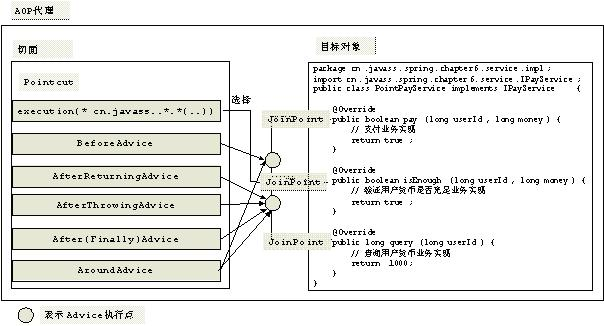

# Spring AOP

## 1、基本

### 1.1 概念

1. **连接点(Jointpoint)**：表示需要在程序中插入横切关注点的扩展点，连接点可能是类初始化、方法执行、方法调用、字段调用或处理异常等等；
2. **切入点(Pointcut)**：选择一组相关连接点的模式，即可以认为连接点的集合；
3. **通知(Advice)**：在连接点上执行的行为,包括前置通知、后置通知、环绕通知，在Spring中通过代理模式实现AOP;
4. **方面/切面(Aspect)**：可以认为是通知、引入和切入点的组合；
5. **引入(inter-type declaration)**：也称为内部类型声明，为已有的类添加额外新的字段或方法；
6. **目标对象(Target Object)**：需要被织入横切关注点的对象，即该对象是切入点选择的对象，需要被通知的对象；
7. **AOP代理(AOP Proxy)**：AOP框架使用代理模式创建的对象，从而实现在连接点处插入通知（即应用切面），就是通过代理来对目标对象应用切面。
在Spring中，AOP代理可以用JDK动态代理或CGLIB代理实现，而通过拦截器模型应用切面。
8. **织入(Weaving)**：织入是一个过程，是将切面应用到目标对象从而创建出AOP代理对象的过程，织入可以在编译期、类装载期、运行期进行。



### 1.2 通知类型

1. **前置通知(Before Advice)**:在切入点选择的连接点处的方法之前执行的通知。
2. **后置通知(After Advice)**:在切入点选择的连接点处的方法之后执行的通知，包括如下类型的后置通知：
3. **后置返回通知(After returning Advice)**:在切入点选择的连接点处的方法正常执行完毕时执行的通知，必须是连接点处的方法没抛出任何异常正常返回时才调用后置通知。
4. **后置异常通知(After throwing Advice)**: 在切入点选择的连接点处的方法抛出异常返回时执行的通知，必须是连接点处的方法抛出任何异常返回时才调用异常通知。
5. **后置最终通知(After finally Advice)**: 在切入点选择的连接点处的方法返回时执行的通知，不管抛没抛出异常都执行，类似于Java中的finally块。
6. **环绕通知(Around Advices)**：环绕通知可以在方法调用之前和之后自定义任何行为，并且可以决定是否执行连接点处的方法、替换返回值、抛出异常等等。

你不必去记忆这种东西，考虑一下一个方法从开始到执行结束，其实上面的几个通知类型也就是覆盖了所有可能出现的情况。

### 1.3 其他

Spring使用JDK动态代理或CGLIB代理来实现

## 2、简单的例子

我们用一个简单的例子来测试一下Spring的AOP功能，这里我们定义了两个类，一个是Worker，一个是LogLog。LogLog有一个名为`say`的方法，该方法中输出一行文字到控制台。
我们希望Worker的每个方法在执行的时候都能够调用LogLog的`say`方法。我们可以做如下的配置：

首先，我们要在基本的命名空间基础上增加一行

```
xmlns:aop="http://www.springframework.org/schema/aop"
```

来启用`aop`命名空间。此外，我们还要增加`schemaLocation`中的配置：

```
http://www.springframework.org/schema/aop
http://www.springframework.org/schema/aop/spring-aop-3.0.xsd
```
然后，我们就可以使用AOP来完成我们想要的功能了：

    <bean id="logLog" class="me.shouheng.spring.aop.LogLog"/>
    <bean id="worker" class="me.shouheng.spring.aop.Worker"/>
    <aop:config>
        <aop:pointcut id="pointcut" expression="execution(* me.shouheng.spring.aop.Worker.*(..)))"/>
        <aop:aspect ref="logLog">
            <aop:before method="say" pointcut-ref="pointcut"/>
            <aop:after method="say" pointcut-ref="pointcut"/>
        </aop:aspect>
    </aop:config>

以上的配置没有问题，我们可以实现期望的功能。这里，我们可以看出，即使是AOP也是需要目标对象和切点定义成Bean。
`pointcut`是所有方法的一个合集，我们使用`expression`来指定这些方法的规则。
`aspect`整合了切入点和通知，它需要引用Bean，并且在子标签中将通知类型、要执行的方法和切入点结合起来。

另外，还需要注意的见点是，切入点和切面都可以被定义多个，但是是有顺序要求的。除了使用`pointcut-ref`引用某个切入点，还可以使用匿名的切入点：

    <aop:after method="say" pointcut="execution(* me.shouheng.spring.aop.Worker.*(..)))"/>

## 3、更加复杂的功能

OK，实际上当我们去看AOP的配置的时候还是比较费解的，如果你是第一次接触它的话。那么，我们抛开相关文档，自己去想一下实际开发过程中可能会需要哪些功能，并看它们如何配置和实现好了。

我们从几个通知作为思考的起点：

1. 前置通知：我想要知道方法的所有入参，我可以用它来记录一些日志
2. 后置返回通知：我想要知道返回的结果是什么，我可以把不机密但重要的信息放在日志里面
3. 后置异常通知：我想要知道具体出现的异常的类型和异常的具体信息，以把它们记录到日志中，或者根据具体的错误原因做一些其他的处理，比如翻译之后返回给客户端
4. 后置最终通知：同上
5. 环绕通知：同上

所以，总结一下我们想要获取的无非下面三个信息:

1. 方法的参数
2. 方法的返回结果
3. 异常的详情

那么，我们接下来就看使用AOP如何获取这三个信息。

### 3.1 获取方法的入参

如下所示，我们这里企图拦截Worker类中的所有的包含一个名为`words`参数的方法，然后我们使用`logLog`的`sayWords`方法进行拦截，并在方法执行之前输出该参数：

    <aop:aspect ref="logLog">
        <aop:pointcut id="pointcut" expression="execution(* me.shouheng.spring.aop.Worker.working(..)) and args(words)"/>
        <aop:before pointcut-ref="pointcut" method="sayWords" arg-names="words"/>
    </aop:aspect>

注意，这里我们在切点的定义中使用`and`表示要符合两种情况，我们也可以用两个`&&`（在XML中是`&amp;&amp;`）来表示，但是显然前者更加简洁。
当我们要拦截的方法中包含多个参数的时候，也可以同时在`args`中指定，只要注意用`,`分隔开即可。

### 3.2 获取方法的返回结果

为了测试获取方法返回结果，我们在`Worker`中增加了一个新的方法`makeA()`，它返回一个字符串类型的数据。我们按照如下所示的方式来获取并使用方法的返回结果：

    <aop:aspect ref="logLog">
        <aop:pointcut id="p2" expression="execution(* me.shouheng.spring.aop.Worker.makeA())"/>
        <aop:after-returning method="sayWords" pointcut-ref="p2" returning="words"/>
    </aop:aspect>

在定义了切点之后，我们使用`aop:after-returning`标签来获取方法的返回值并对其进行处理。这里我们用了`logLog`的`sayWords()`方法，使用`returning`属性指定返回值应用到`sayWords()`方法的参数的名称。

以上程序执行的最终效果就是，在执行了`makeA()`方法之后，将返回的结果作为`words`参数传入到`sayWords()`方法中。

需要注意的地方是，需要使用`aop:after-returning`标签才能获取方法的返回结果并进行处理。

### 3.3 获取方法的执行的异常

为了测试拦截异常的逻辑，我们需要在LogLog类中增加一个方法`handleError(Throwable throwable)`。我们还要在Worker中定义一个`throwMethod()`方法，它内部抛出一个异常。然后我们进行如下的配置：
	
    <aop:aspect ref="logLog">
        <aop:pointcut id="p3" expression="execution(* me.shouheng.spring.aop.Worker.throwMethod())"/>
        <aop:after-throwing method="handleError" pointcut-ref="p3" throwing="throwable"/>
    </aop:aspect>

拦截异常和拦截方法执行结果的逻辑类似，我们需要指定一个方法，然后在`throwing`属性中指定该方法中的参数的名称。当抛出异常的时候，就会把异常作为该参数传入到方法中，我们可以在方法中对异常进行处理。

## 4、使用@Aspect配置AOP

除了使用schema基于XML配置AOP，还可以使用注解来进行配置。Spring默认不支持@AspectJ风格的切面声明，为了支持需要使用如下配置：

    <aop:aspectj-autoproxy/>  

然后，我们就可以进行配置和使用了。使用注解的方式和使用XML配置的方式基本类似，我们看下下面的代码。

首先是切面的定义：

	@Aspect
	public class AspectObj {

		@Pointcut(value = "execution(* me.shouheng.spring.aspect.*.*(..)) && args(params)", argNames = "params")
		public void pointcut(String params) { }

		@Before(value = "pointcut(params)", argNames = "params")
		public void before(String params) {
			System.out.println("================= before =================");
		}
	}

这里我们使用`@Aspect`注解，它表明该类是一个切面。然后，我们定义一个方法体为空的方法，并使用`@Pointcut`注解，表明它是一个切点。可以看出它的配置方式和使用XML基本一样。

然后，我们需要定义一个通知，这里我们用的是前置通知，我们用`@Before`注解声明方法为前置通知，并指定切点和方法的参数名。

配置完这些之后，我们定义一个测试类，来看一下我们的是否能够在方法执行之前拦截到方法，并获取到方法的参数。我们定义一个名为HelloAspect的类，并在其中定义一个方法：

    public void sayHello(String params) {
        System.out.println("Hello, " + params);
    }

这样我们需要在XML中将上述定义的两个类作为Bean声明在XML中，这样它们就可以被IoC管理了。OK，我们获取上下文之后调用Bean的方法确实可以达到我们预期的效果。

以上是基于注解的AOP的基本配置方式，其他类型的通知的配置方式与其基本相似，我们只要知道其中的逻辑就可以了，没必要面面俱到。


	


### 使用XML

除了Spring包之外还要加入

        <dependency>
            <groupId>org.aspectj</groupId>
            <artifactId>aspectjweaver</artifactId>
            <version>1.6.2</version>
        </dependency>

切面类，实现了MethodBeforeAdvice和AfterReturningAdvice两个接口：

	public class LogAOP implements MethodBeforeAdvice, AfterReturningAdvice, ThrowsAdvice{
	
	    public void before(Method method, Object[] objects, Object o) throws Throwable {
	        System.out.println("before");
	    }
	
	    public void afterReturning(Object o, Method method, Object[] objects, Object o1) throws Throwable {
	        System.out.println("afterReturning");
	    }
	
        public void afterThrowing(Object[] args, ServletException e, Method method, Object target){
            System.out.println("afterThrowing" );
        }
	
	    public void after(JoinPoint joinPoint) {
	        System.out.println("after");
	    }
	
	    public void around(ProceedingJoinPoint pjp) throws Throwable{
	        long current = System.currentTimeMillis();
	        pjp.proceed();
	        System.out.println("around cost:" + (System.currentTimeMillis() - current));
	    }
	}

定义的类:

	public class MyBean {
	
	    public void say() {
	        System.out.println("say");
	    }
	
	    public void sayHello() {
	        System.out.println("Hllo");
	    }
	}

XML配置文件：

    <bean name="myBean" class="my.shouheng.aop.MyBean"/>

    <bean id="log" class="my.shouheng.aop.LogAOP"/>

    <aop:config>
        <aop:pointcut id="pointcut" expression="execution(public * say*(..))"/>
        <aop:advisor advice-ref="log" pointcut-ref="pointcut"/>
        <aop:aspect ref="log">
            <aop:after method="after" pointcut-ref="pointcut"/>
            <aop:around method="around" pointcut-ref="pointcut"/>
            <!--<aop:after-throwing method="afterThrowing" pointcut-ref="pointcut"/>-->
        </aop:aspect>
    </aop:config>

1. 这里pointcut标签中定义了切点的id和规则expression，即public的任何返回类型的以say开头的任何输入参数的方法会被当作切点；
2. 这里的advisor标签指定了切点要执行的逻辑，这里是LogAOP类，以及针对的切点。
3. 所以，简单来理解就是“pointcut定义了插入的规则，advice定义了切入处要执行的逻辑，advisor将pointcut和advice联系起来”

输出结果：

	before method:say
	say
	afterReturning method:say
	afterReturning cost:73
	before method:sayHello
	Hllo
	afterReturning method:sayHello
	afterReturning cost:0

### 切入点指示符

#### 1.类签名表达式`Whithin(<type name>)`

1. within(my.palm..*)：匹配my.palm及其子包中所有类的所有方法
2. within(my.palm.ClassName):匹配my.palm.ClassName类中所有方法
3. within(MyInterface+)：匹配MyInterface接口所有实现类的所有方法
4. within(my.palm.BaseClass)：匹配my.palm.BaseClass及其子类的所有方法

#### 2.方法签名`execution(<scope> <return type> <full-qulified-class-name>.<method>(params))`

1. execution(* my.shouhengn.Palm.*(..)):my.shouhengn.Palm中所有方法
2. execution(public * my.shouhengn.Palm.*(..)):my.shouhengn.Palm中所有公共方法
3. execution(public * my.shouhengn.Palm.*(long,..)):my.shouhengn.Palm中所有第一个参数为long型的公共方法
4. execution(public String my.shouhengn.Palm.*(..)):my.shouhengn.Palm中所有返回类型为String的公共方法

#### 3.其他

1. bean(*Service):所有后缀名为Service的Bean
2. @anotation(my.shouheng.Annotation):所有使用Annotaion注解的方法会被调用
3. @within(my.shouheng.Annotation):所有使用Annotaion注解的类的方法会被调用
4. this(my.shouheng.MyInterface):所有实现了my.shouheng.MyInterface接口的代理对象的方法会被调用

#### 4.通配符

1. `..`:任意参数列表，任何数量的包
2. `+`:给定类的任何子类
3. `*`:任何数量的字符

### 使用注解的方式

声明切面：

	@Aspect
	public class LogAOP {
	
	    @Before(value = "execution(public * say*(..))")
	    public void before() throws Throwable {
	        System.out.println("before");
	    }
	
	    @AfterReturning(value = "execution(public * say*(..))")
	    public void afterReturning() throws Throwable {
	        System.out.println("afterReturning");
	    }
	
	    @AfterThrowing("execution(public * say*(..))")
	    public void afterThrowing(){
	        System.out.println("afterThrowing" );
	    }
	
	    @After("execution(public * say*(..))")
	    public void after(JoinPoint joinPoint) {
	        System.out.println("after");
	    }
	
	    @Around("execution(public * say*(..))")
	    public void around(ProceedingJoinPoint pjp) throws Throwable{
	        long current = System.currentTimeMillis();
	        pjp.proceed();
	        System.out.println("around cost:" + (System.currentTimeMillis() - current));
	    }
	}

除了在每个方法上面定义切面的切入点规则，也可以显得定义一个方法在上面使用@PointCur注解指定切入规则。然后，在各个注解中调用该切入点即可。

使用切面的类：

	public class MyBean {
	
	    public void say() {
	        System.out.println("say");
	    }
	
	    public void sayHello() {
	        System.out.println("Hllo");
	    }
	
	    public void sayWithException() {
	        System.out.println("sayWithException");
	        throw new IllegalArgumentException("Exception");
	    }
	}

配置文件：

    <bean name="myBean" class="my.shouheng.aop.MyBean"/>
    <bean name="log" class="my.shouheng.aop.LogAOP"/>
    <aop:aspectj-autoproxy/>

测试类：

    public static void main(String ...args) {
        ClassPathXmlApplicationContext ctx =
                new ClassPathXmlApplicationContext("/XmlBeanContext.xml");
        MyBean myBean = ctx.getBean("myBean", MyBean.class);
        myBean.say();
        myBean.sayWithException();
    }

输出结果：

	before
	Exception in thread "main" java.lang.IllegalArgumentException: Exception
		......
	say
	around cost:32
	after
	afterReturning
	before
	sayWithException
	after
	afterThrowing

#### 当指定的方法中具有参数的时候

比如如下方法，这里具有一个int类型的参数count，那么我们怎么在切面的方法中获取到从count方法中传入的参数呢？

    public void count(int count) {  }
	
	@Aspect
	public class LogAOP {
	
	    @Before(value = "execution(public * count(int)) && args(count)")
	    public void before(int count) throws Throwable {
	        System.out.println("before " + count);
	    }
   }

这里是在切面中获取切点的一个示例——我们需要在切点的定义中指定args参数，然后在其中指定参数的名称。这里，当我们调用count方法的时候，就会调用方法之前先调用这里的方法输出count的值。


