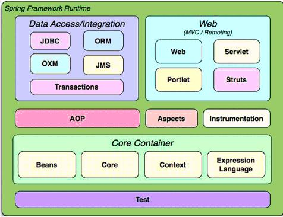

# Spring基本

## 1、Spring简介

### 1.1 Spring的主要功能：

1. 帮助我们管理对象之间的依赖关系及其生命周期；
2. 提供像通用日志记录、性能统计、安全控制、异常处理等面向切面的能力；
3. 帮助我们管理数据库事务，本身提供了一套简单的JDBC访问实现，并且易于与第三方数据访问框架集成；
4. 提供一套自己的web层框架Spring MVC；
5. 提供粘合其他技术和框架的能力，易于与其他的三方的库整合。

### 1.2 Spring架构

### 1.3 Spring典型应用

## 2、环境搭建

使用IDEA，创建Maven-WebApp。然后，我们进行如下的配置：

### 2.1 Java 8 环境的配置

需要在pom.xml的build标签中加入如下的配置：

    <plugin>
    <groupId>org.apache.maven.plugins</groupId>
    <artifactId>maven-compiler-plugin</artifactId>
    <version>3.1</version>
    <configuration>
        <source>1.8</source>
        <target>1.8</target>
    </configuration>
    </plugin>

配置完成之后，我们就可以在代码中直接使用Java8来进行编程了。

### 2.2 Spring 开发环境

这里，我们一次性导入Spring开发需要的基本的配置，不仅包括了IOC相关内容，同时也包括Test和Aop等模块：

    <dependency>
        <groupId>org.springframework</groupId>
        <artifactId>spring-core</artifactId>
        <version>${spring.version}</version>
    </dependency>
    <dependency>
        <groupId>org.springframework</groupId>
        <artifactId>spring-beans</artifactId>
        <version>${spring.version}</version>
    </dependency>
    <dependency>
        <groupId>org.springframework</groupId>
        <artifactId>spring-aop</artifactId>
        <version>${spring.version}</version>
    </dependency>
    <dependency>
        <groupId>org.springframework</groupId>
        <artifactId>spring-test</artifactId>
        <version>${spring.version}</version>
    </dependency>
    <dependency>
        <groupId>org.springframework</groupId>
        <artifactId>spring-context</artifactId>
        <version>${spring.version}</version>
    </dependency>
    <dependency>
        <groupId>org.springframework</groupId>
        <artifactId>spring-aspects</artifactId>
        <version>${spring.version}</version>
    </dependency>

注意一下这里我们没有直接在依赖中配置需要的版本号，而是统一放在properties标签中：

    <properties>
        <spring.version>4.3.10.RELEASE</spring.version>
    </properties>

好了，至此我们的Spring开发环境已经搭建完毕，接下来就让我们使用一个基本的例子来检验一下我们的环境是否搭建成功。

### 2.3 环境测试：一个简单的注入的例子

简单交待一下，这里我们定义了一个接口`IHelloApi`，然后定义一个它的实现类`HelloApiImpl`：

    public interface IHelloApi {
        void sayHelloWorld();
    }

	public class HelloApiImpl implements IHelloApi {
        @Override
        public void sayHelloWorld() {
            System.out.println("Hello world!");
        }
    }
	
然后，我们在`main`目录下面创建一个名为`resources`的目录，并使用鼠标右键单击，选择`Mark as`->`Resources Root`。
然后，在该目录中创建一个名为`HelloWorld.xml`的文件，并在文件中配置我们的Bean：

    <?xml version="1.0" encoding="UTF-8"?>
    <beans xmlns="http://www.springframework.org/schema/beans"
           xmlns:xsi="http://www.w3.org/2001/XMLSchema-instance"
           xsi:schemaLocation="http://www.springframework.org/schema/beans
           http://www.springframework.org/schema/beans/spring-beans-3.0.xsd">
        <!--这里的calss属性的值就是我们要配置的实例的具体位置-->
        <bean id="hello" class="me.shouheng.spring.hello.beanimp.HelloApiImpl"/>
    </beans>

然后，我们创建一个测试类`HelloWorldTest`，这里我们用`ClassPathXmlApplicationContext`来获取一个上下文，并从其中来获取Bean实例并使用：

    public class HelloWorldTest {
        public static void main(String...args) {
            ApplicationContext context = new ClassPathXmlApplicationContext("HelloWorld.xml");
            IHelloApi helloApi = (IHelloApi) context.getBean("hello");
            helloApi.sayHelloWorld();
        }
    }

根据，我们定义的Bean实例。如果能正确地输出`Hello world!`，那么我们的环境就算是搭建成功了。
