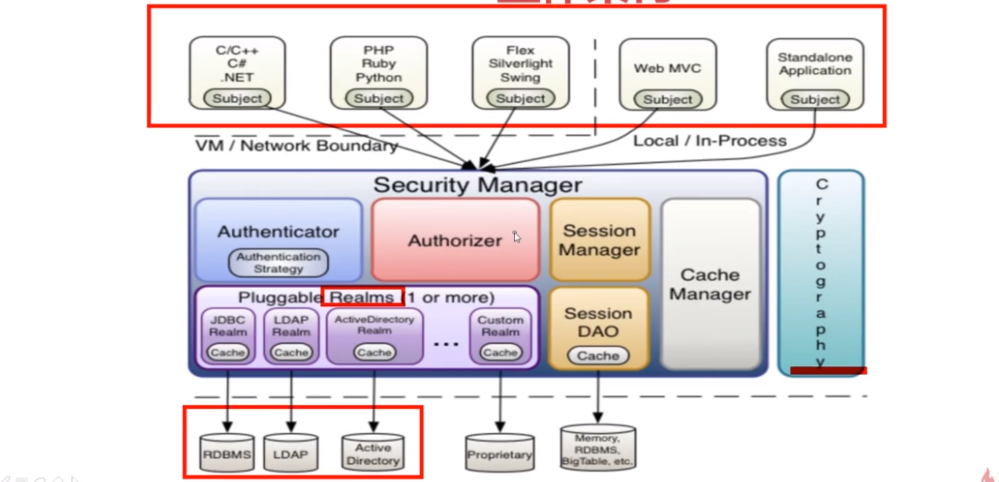

# Shiro

## 1、简介

Apache开源的认证、授权、企业会话管理、安全加密等的框架。相比于Spring Security，Shiro具有下面几个优势：
1).使用起来更加简单、灵活；2).可以脱离Spring使用，而Spring Security不可脱离Spring；3).权限管理的粒度比较粗，可以个性化定制。

### 1.1 整体架构



以上是Shiro的整体架构，最上面的一层Subject表示当前的用户。Security Manager是Shiro用户管理的核心。Cryptogaphy主要用来对数据进行加密。
在Security Manager部分，Authenticator用来做用户认证，Authorizer用来做授权管理，Session Manager用来做会话管理，它通过Session DAO获取会话信息。
Cache Manager用来做缓存管理，用来缓存用户的身份和认证信息等。
下面的Realms一层类似于一层中间桥梁，用于从数据源中获取授权信息等。

### 1.2 简单的示例

这里我们使用一个简单的测试程序看下Shiro中的各个模块的一些作用。

首先，我们需要搭建一个开发框架，这里我们需要引入两个依赖，一个用来进行单元测试，一个就是Shiro的核心包：

```
    <dependency>
        <groupId>junit</groupId>
        <artifactId>junit</artifactId>
        <version>4.12</version>
        <scope>test</scope>
    </dependency>
    <dependency>
        <groupId>org.apache.shiro</groupId>
        <artifactId>shiro-core</artifactId>
        <version>1.4.0</version>
    </dependency>
```

然后，我们创建如下的单元测试：

```
public class AuthenticationTest {

    private SimpleAccountRealm realm = new SimpleAccountRealm();

    @Before
    public void prepare() {
        realm.addAccount("WngShhng", "123456");
    }

    @Test
    public void testAuthentication() {
        DefaultSecurityManager securityManager = new DefaultSecurityManager();
        securityManager.setRealm(realm);
        SecurityUtils.setSecurityManager(securityManager);
        Subject subject = SecurityUtils.getSubject();
        AuthenticationToken authenticationToken = new UsernamePasswordToken("WngShhng", "123456");
        subject.login(authenticationToken);
        System.out.println("Is authenticated" + subject.isAuthenticated());
    }
}
```

这里我们先创建了一个Realm对象，并在单元测试方法被调用之前向其中添加一些账号信息。
然后，我们获取了一个`SecurityManager`实例并将上面定义的Realm注入到其中。
然后，我们将上面定义的`SecurityManager`通过`SecurityUtils`的`setSecurityManager`方法注入。
之后，我们通过设置完毕的`SecurityUtils`获取一个`Subject`对象。
之后，我们使用用户和密码创建一个Token，并调用上面的`Subject`的`login`方法尝试进行登录。
最终的登录信息存储在subject中，我们可以通过其中的一些方法来获取，比如上面的`isAuthenticated()`就是用来判断用户是否被认证成功的。


